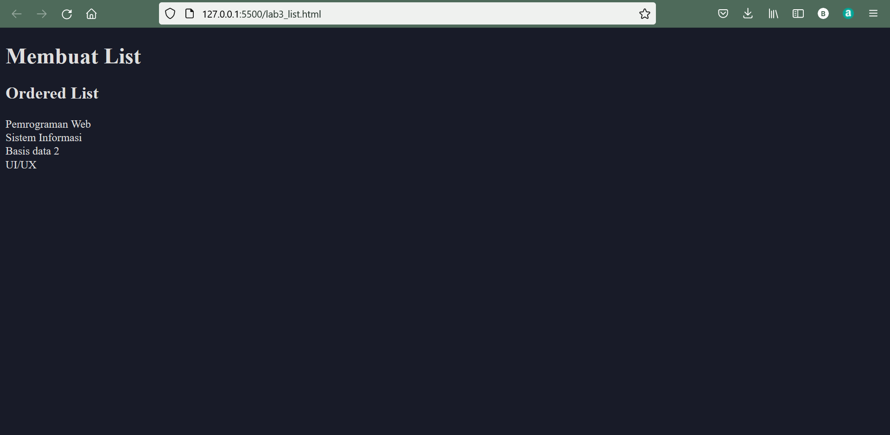

|  Berliana Noviansyah  |  312010373  |
|-----------------------|-------------|
|    Pemrograman Web    |   TI.20.A1  |

# Lab3Web
### Praktikum 3 pertemuan 4

Pada petemuan kali ini, mahasiswa diminta untuk membuat **list tabel** dan **form**

## 1). Membuat ordered list

Ordered List adalah jenis list berurutan yang ditampilkan menggunakan anhka atau nomor atau huruf.
Biasa digunakan untuk menampilandaftar urut seperti pemenang lomba, ranking kelas dan urutan lain yang membutuhkan nomor.
Pada contoh kali ini, saya akan membuat list mata kuliah.
Hasil output yang didapatkan adalah sebagai berikut :
 

Dengan Inputan sebagai berikut :

```html
<!DOCTYPE html>
<html lang="en">
<head>
    <meta charset="UTF-8">
    <meta http-equiv="X-UA-Compatible" content="IE=edge">
    <meta name="viewport" content="width=device-width, initial-scale=1.0">
    <title>HTML lanjutan</title>
</head>
<body>
    <header>
        <h1>Membuat List</h1>
    </header>
    <section id="order-list">
        <h2>Ordered List</h2>
        <ol>
            <li>Pemrograman Web</li>
            <li>Sistem Informasi</li>
            <li>Basis data 2</li>
            <li>UI/UX</li>
        </ol>
    </section>
</body>
</html>
```

## 2). Cara membuat Unordered List
