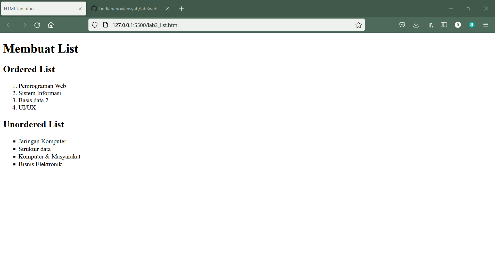
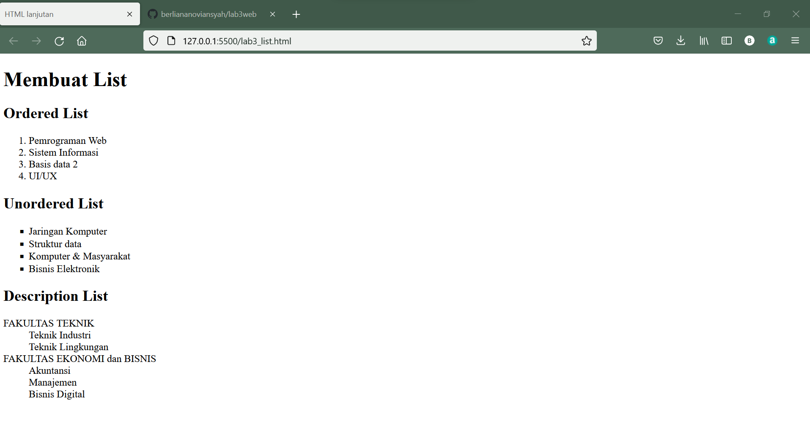
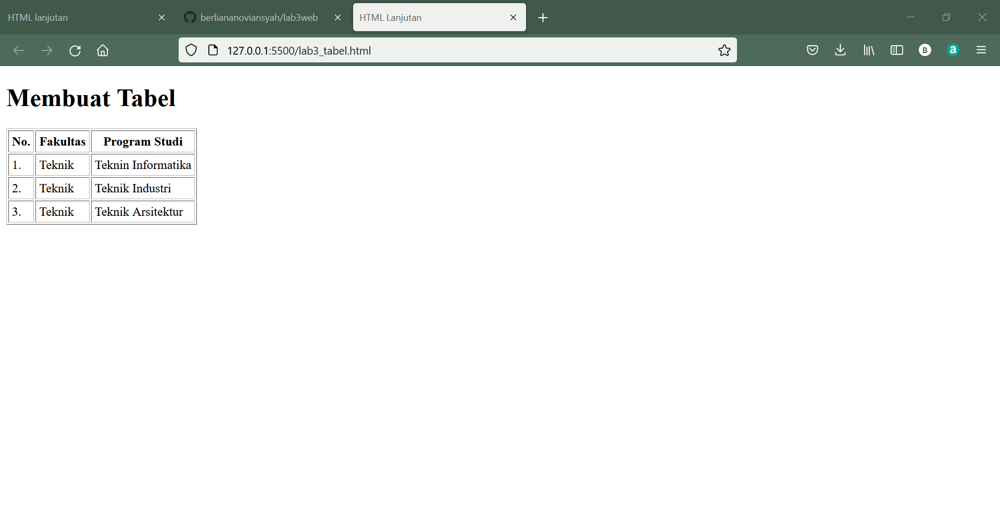
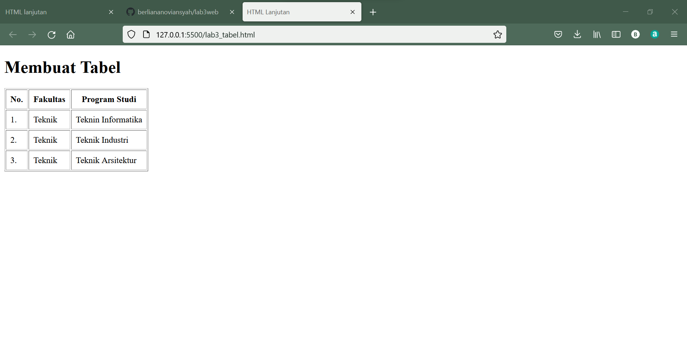
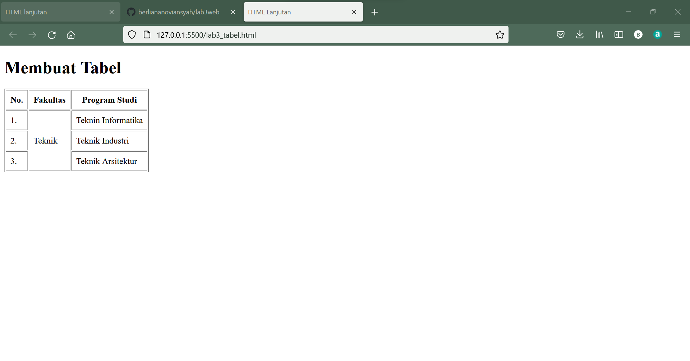
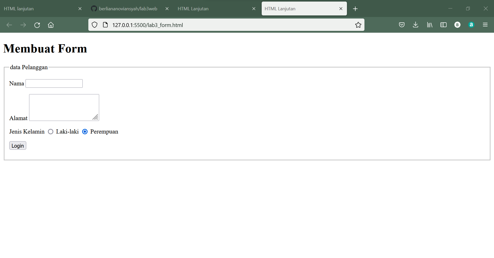
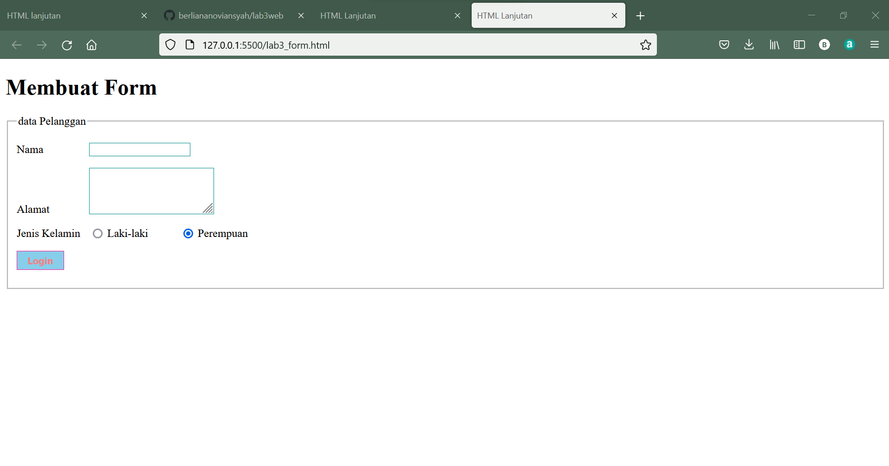
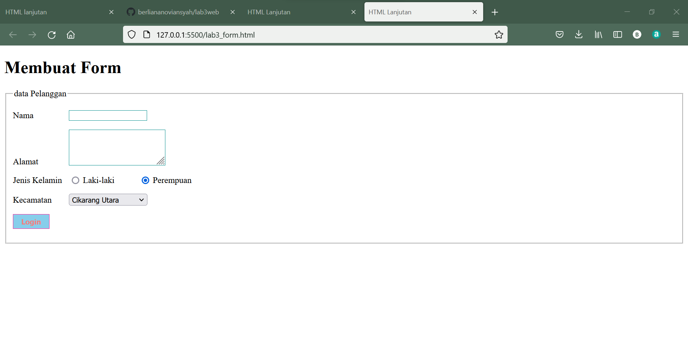

|  Berliana Noviansyah  |  312010373  |
|-----------------------|-------------|
|    Pemrograman Web    |   TI.20.A1  |

# Lab3Web
### Praktikum 3 pertemuan 4

Pada petemuan kali ini, mahasiswa diminta untuk membuat **list tabel** dan **form**

## 1). Membuat ordered list

Ordered List adalah jenis list berurutan yang ditampilkan menggunakan anhka atau nomor atau huruf.
Biasa digunakan untuk menampilandaftar urut seperti pemenang lomba, ranking kelas dan urutan lain yang membutuhkan nomor.
Pada contoh kali ini, saya akan membuat list mata kuliah.
Hasil output yang didapatkan adalah sebagai berikut :

 

Dengan Inputan sebagai berikut :

```html
<!DOCTYPE html>
<html lang="en">
<head>
    <meta charset="UTF-8">
    <meta http-equiv="X-UA-Compatible" content="IE=edge">
    <meta name="viewport" content="width=device-width, initial-scale=1.0">
    <title>HTML lanjutan</title>
</head>
<body>
    <header>
        <h1>Membuat List</h1>
    </header>
    <section id="order-list">
        <h2>Ordered List</h2>
        <ol>
            <li>Pemrograman Web</li>
            <li>Sistem Informasi</li>
            <li>Basis data 2</li>
            <li>UI/UX</li>
        </ol>
    </section>
</body>
</html>
```

## 2). Cara membuat Unordered List

Unordered List adalah list data yang tak terurut dengan menggunakan simbol-simbol pada item-nya.

Berikut adalah hasil inputan nya :

```html
 <section id="unorder-list">
        <h2>Unordered List</h2>
        <ul type="square">
            <li>Jaringan Komputer</li>
            <li>Struktur data</li>
            <li>Komputer & Masyarakat</li>
            <li>Bisnis Elektronik</li>
        </ul>
    </section>
</body>
</html>
```

Dan outputnya :




## 3). Membuat Description List

Description lIst adalah jenis list yang ditunjukan untuk membuat struktur yang berisi deskripsi arau penjelasan dalam HTML.

Inputannya adalah :

```html
 <section id="unorder-list">
        <h2>Description List</h2>
        <dl>
            <dt>FAKULTAS TEKNIK</dt>
            <dd>Teknik Industri</dd>
            <dd>Teknik Lingkungan</dd>
            <dt>FAKULTAS EKONOMI dan BISNIS</dt>
            <dd>Akuntansi</dd>
            <dd>Manajemen</dd>
            <dd>Bisnis Digital</dd>
        </dl>
    </section>
```

Dan output sebagai berikut :




## 4). Membuat Tabel

Tabel digunakan untuk menampilkan data yang terusun dalam bentuk kolom dan baris seperti laporan, pembukuan, dan sejenisnya pada halaman web.

Berikut adalah contohnya :



Codingnya sebagai berikut :

```html
<!DOCTYPE html>
<html lang="en">

<head>
    <meta charset="UTF-8">
    <meta http-equiv="X-UA-Compatible" content="IE=edge">
    <meta name="viewport" content="width=device-width, initial-scale=1.0">
    <title>HTML Lanjutan</title>
</head>
<body>
    <header>
        <h1>Membuat Tabel</h1>
    </header>
    <table border="1" cellpadding="4" cellspasing="0">
    <thead>
        <tr>
            <th>No.</th>
            <th>Fakultas</th>
            <th>Program Studi</th>
        </tr>
    </thead>
    <tbody>
        <tr>
            <td>1.</td>
            <td>Teknik</td>
            <td>Teknin Informatika</td>
        </tr>
        <tr>
            <td>2.</td>
            <td>Teknik</td>
            <td>Teknik Industri</td>
        </tr>
        <tr>
            <td>3.</td>
            <td>Teknik</td>
            <td>Teknik Arsitektur</td>
        </tr>
    </tbody>
    </table>
</body>
</html>
```


## 5). Mengatur Margin dan Padding pada Tabel

Pada bagian cellpading sebelumnya pada sub judul "Membuat Tabel" yang saya input adalah "4" dan cellspacing "0".
Setelahnya saya akan mengubah cellpadding menjadi "8" dan cellspacing tetap pada "0"




## 6). Menggabungkan Sel Data

Output pada tampilan browsernya adalah sebagai berikut :



Codingnya sama seperti pada sub judul "membuat tabel", dengan menambahkan perintah "rowspan" pada pengaturan tabel nomor "1."


## 7). Membuat Form

Untuk membuat form pada HTML kta dapat menggunakan tag form kemudian menambahkan "fieldset" dan "legend". Namun formalnya hanya form tabel dan input saja.


Berikut adalah contoh codingnya :

```html
<!DOCTYPE html>
<html lang="en">
<head>
    <meta charset="UTF-8">
    <meta http-equiv="X-UA-Compatible" content="IE=edge">
    <meta name="viewport" content="width= , initial-scale=1.0">
    <title>HTML Lanjutan</title>
</head>
<body>
    <header>
        <h1>Membuat Form</h1>
    </header>
    <form action="proses.php" method="post">
        <fieldset>
            <legend>data Pelanggan</legend>
            <p>
                <label for="nama">Nama</label>
                <input type="text" id="nama" name="nama">
            </p>
            <p>
                <label for="alamat">Alamat</label>
                <textarea name="alamat" id="alamat" cols="20" rows="3">            
                </textarea>
            </p>
            <p>
                <label for="jenis kelamin">Jenis Kelamin</label>
                <input type="radio" name="kelamin" id="jk_l" value="L">
                <label for="jk_l"> Laki-laki</label>
                <input type="radio" name="kelamin" id="jk_p" value="P">
                <label for="jk_p">Perempuan</label>
            </p>
            <p><input type="submit" value="Login"></p>
        </fieldset>
    </form>
</body>
</html>
```

Output :



## 8). Menambahkan Style pada Form

Berikut adalah contoh codingnya :
```html
  <style>
        form p > label{
            display: inline-block;
            width: 100px;
        }
        form input[type="text"], form textarea{
            border: 1px solid darkgray;
        }
        form input[type='submit']{
            border: 1px solid deeppink;
            color: lightcoral;
            font-weight: bold;
            padding: 5px 15px;
        }
    </style>
```

Dan hasil outpunya adalah sebagai berikut :



# Pertanyaan dan Jawaban


### 1). Buatlah form yang menampilkan Dropdown menu dan Listbox dengan multiple selection.

Berikut adalah contoh Dropdown menu:




Dengan contoh coding sebagai berikut :

```html
<p>
                <label>Kecamatan</label>
                <select name="kecamatan" id="kecamatan">
                    <option value="Pilih Kecamatan Asal">--Pilih Kecamatan Asal--<option>
                    <option value="Cikarang Utara">Cikarang Utara</option>
                    <option value="Cikarang Barat">Ciakrang Barat</option>
                    <option value="Cikarang Selatan">Cikarang Selatan</option>
                    <option value="Cikarang Timur">Cikarang Timur</option>
                    <option value="Washington">Washington</option>
                </select>
 </p>